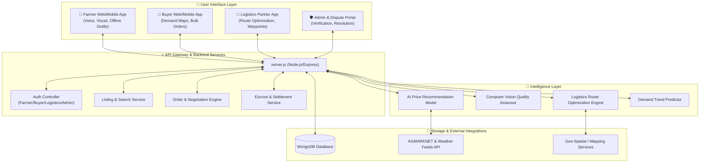
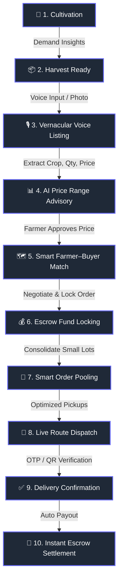
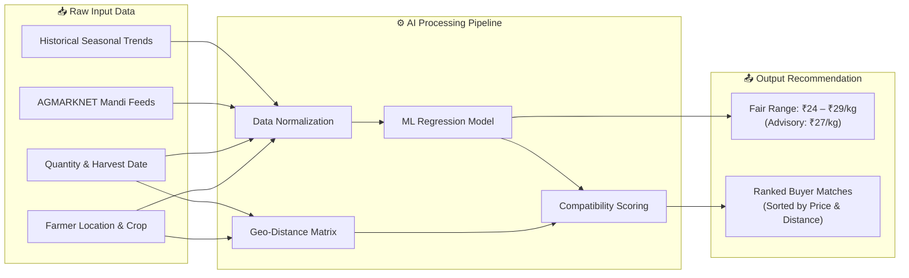
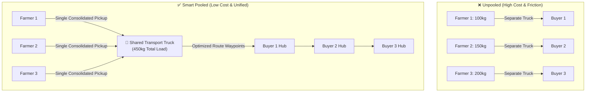
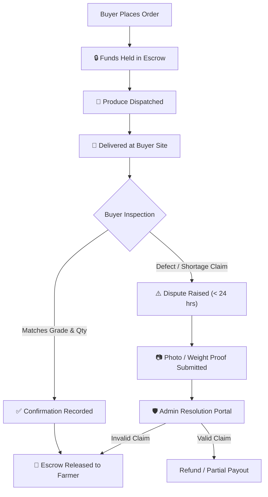

# 🌾 Uyirva (SIH26033) — AI-Powered Farmgate Marketplace
> **Digitizing Intermediary Functions for Transparent Agricultural Trade & Smart Logistics Aggregation**

[](https://smartindiahackathon.gov.in)
[](https://nodejs.org)
[](https://vitejs.dev)
[](LICENSE)
[]()

---

## 📌 Executive Overview

**Uyirva** is a farmgate-first digital marketplace engineered to empower smallholder farmers by directly connecting them with buyers—such as retailers, restaurants, institutions, and end-consumers. 

Rather than naively claiming to eliminate every physical middleman, **Uyirva digitizes essential intermediary functions** (aggregation, price discovery, logistics routing, quality validation, and financial trust), solving structural friction in traditional supply chains.

> 💡 **One-Line Pitch:**  
> *"An AI-powered farmgate marketplace that connects farmers directly with buyers, predicts fair price ranges, pools small-lot logistics, supports computer-vision quality verification, and enables secure digital escrow settlement."*

---

## 🚀 Core Solution Modules

| # | Solution Module | Problem Solved | Core Technical Mechanism |
|---|---|---|---|
| 1️⃣ | **Smart Farmer–Buyer Match** | Lack of immediate demand visibility | Geo-spatial matching algorithm filtering crop, volume, location & delivery windows |
| 2️⃣ | **AI Fair Price Engine** | Information asymmetry & distress selling | Machine Learning regression over historical prices, seasonality, weather & market trends |
| 3️⃣ | **Smart Order Pooling** | Expensive transport for small produce lots | Consolidate nearby demand/supply into optimized multi-stop transport routes |
| 4️⃣ | **Voice-Assisted Listing** | Low digital literacy & complex input forms | Regional Speech-to-Text (STT) + NLP entity extraction + icon-driven UI |
| 5️⃣ | **AI Quality Assistance** | Quality disputes & subjective grading | Computer Vision image analysis estimating visible size, color uniformity & defect index |
| 6️⃣ | **Escrow & Settlement** | Delayed payments & financial distrust | Locked buyer funds released upon digital delivery verification with built-in dispute resolution |
| 7️⃣ | **Demand Prediction** | Post-harvest demand uncertainty | Time-series forecasting based on urban consumption trends & market deficit indicators |
| 8️⃣ | **Farmgate Marketplace** | Heavy dependence on physical mandis | Direct trade discovery & transaction locking before produce leaves the farm |

---

## 📊 Visual System Workflows & Flowcharts

### 1. High-Level System Architecture


---

### 2. End-to-End User Journey Flowchart


---

### 3. AI Fair Price & Geo-Spatial Matching Pipeline


---

### 4. Smart Order Pooling & Route Optimization


---

### 5. Digital Escrow & Multi-Stage Dispute Workflow


---

## 🔍 Deep-Dive into Solution Innovations

### 🎙️ 1. Vernacular Voice-Assisted Listing
* **Problem:** Farmers struggle with complex multi-step web/mobile forms.
* **Mechanism:** The farmer speaks a simple sentence: *"Thakkali (Tomato) — 500 kg — 25 rupees per kg"*.
* **Implementation:** Speech-to-Text converts audio to Tamil/Hindi/Regional scripts, and NLP extracts crop name, weight, and expected baseline price.
* **Offline-First:** Drafts are saved locally in `IndexedDB`/`LocalStorage` and auto-sync when network connectivity returns.

### 📈 2. AI Fair Price Recommendation Engine
* **Advisory Positioning:** Replaces price exploitation with data intelligence. The model outputs a **transparent range** (e.g., ₹24 – ₹29/kg) rather than a single rigid value.
* **Feature Vector:** Historical mandi rates + seasonality + local weather forecasts + harvest volume + quality score.
* **Farmer Control:** The AI price is purely advisory; farmers retain final control to set or negotiate their offer.

### 🚚 3. Smart Logistics Pooling & Route Optimization
* **Problem:** Direct farmgate selling fails economically when transporting small quantities across individual trips.
* **Solution:** Combines nearby supply lots and buyer orders to maximize vehicle payload capacity.
* **Route Engine:** Calculates nearest neighbor pickup clusters and optimizes multi-stop delivery waypoints, drastically lowering transport cost per kg.

### 📷 4. Computer Vision Quality Assistance Score
* **Mechanism:** Farmers upload crop photos. An image-analysis module checks visible quality parameters:
  * **Size Uniformity Index**
  * **Color Saturation / Ripeness Score**
  * **Surface Defect / Blemish Percentage**
* **Output:** Generates a objective **Quality Assistance Score** attached to the listing, boosting buyer confidence prior to dispatch.

### 🛡️ 5. Escrow Payment & Dispute Settlement
* **Trust Guarantee:** Buyer funds are held in escrow upon order placement.
* **Settlement Trigger:** Funds release automatically to the farmer's bank account once digital receipt (OTP/QR scan) is confirmed by the buyer.
* **Dispute Protocol:** Time-bound (24h) evidence submission workflow managed via [disputeResolution.controller.js](file:///f:/sih/controllers/disputeResolution.controller.js) and [escrow.controller.js](file:///f:/sih/controllers/escrow.controller.js).

---

## 📂 Project Codebase Architecture

```
f:\sih
├── 📄 server.js                           # Central Express server entrypoint & API Router
├── 📄 package.json                         # Project metadata, scripts & dependencies
├── 📄 index.html                           # Landing page & app entry point
├── 📄 kootu.html                           # Smart Order Pooling & Aggregation Hub
├── 📄 SIH26033_Detailed_Solutions.pdf      # Detailed Problem & Solution Blueprint
│
├── 📁 api/                                 # Express Route Handlers
│   ├── [farmer.routes.js](file:///f:/sih/api/farmer.routes.js)       # Farmer management, listing & dashboard endpoints
│   ├── [buyer.routes.js](file:///f:/sih/api/buyer.routes.js)         # Buyer discovery & requirements endpoints
│   ├── [orders.routes.js](file:///f:/sih/api/orders.routes.js)       # Order placement, escrow status & transactions
│   ├── [logistics.routes.js](file:///f:/sih/api/logistics.routes.js) # Transport pooling & route update endpoints
│   └── [admin.routes.js](file:///f:/sih/api/admin.routes.js)         # Verification & dispute resolution endpoints
│
├── 📁 controllers/                         # Core Business & Algorithmic Logic
│   ├── [listing.controller.js](file:///f:/sih/controllers/listing.controller.js)             # Crop listing CRUD & voice parsing
│   ├── [search.controller.js](file:///f:/sih/controllers/search.controller.js)               # Geo-spatial farmer-buyer matching
│   ├── [buyerRequirement.controller.js](file:///f:/sih/controllers/buyerRequirement.controller.js) # Buyer demand posting
│   ├── [buyerOrders.controller.js](file:///f:/sih/controllers/buyerOrders.controller.js)     # Buyer order processing
│   ├── [farmerOrders.controller.js](file:///f:/sih/controllers/farmerOrders.controller.js)   # Farmer order tracking
│   ├── [logisticsVisibility.controller.js](file:///f:/sih/controllers/logisticsVisibility.controller.js) # Logistics tracking
│   ├── [routeUpdate.controller.js](file:///f:/sih/controllers/routeUpdate.controller.js)     # Route optimization calculations
│   ├── [negotiation.controller.js](file:///f:/sih/controllers/negotiation.controller.js)       # Price negotiation & counters
│   ├── [escrow.controller.js](file:///f:/sih/controllers/escrow.controller.js)               # Escrow status & fund locking
│   ├── [disputeResolution.controller.js](file:///f:/sih/controllers/disputeResolution.controller.js) # Evidence review & refunds
│   ├── [analytics.controller.js](file:///f:/sih/controllers/analytics.controller.js)         # Platform market intelligence
│   └── [verification.controller.js](file:///f:/sih/controllers/verification.controller.js)   # User verification & badge check
│
├── 📁 models/                              # Database Schemas
│   ├── [User.model.js](file:///f:/sih/models/User.model.js)             # Farmer, Buyer, Driver & Admin roles
│   ├── [Listing.model.js](file:///f:/sih/models/Listing.model.js)         # Crop listings with voice & quality data
│   ├── [BuyerRequirement.model.js](file:///f:/sih/models/BuyerRequirement.model.js) # Posted buyer demand requirements
│   ├── [Order.model.js](file:///f:/sih/models/Order.model.js)           # Order state & tracking milestones
│   ├── [Transaction.model.js](file:///f:/sih/models/Transaction.model.js)   # Financial ledger & payout records
│   └── [Dispute.model.js](file:///f:/sih/models/Dispute.model.js)       # Dispute evidence, claims & audit logs
│
└── 📁 frontend/                            # Client User Interface
    ├── 📄 index.html                       # Responsive portal interface
    ├── 📄 dashboard.html                   # Farmer & buyer dashboard
    ├── 📄 buyer-dashboard.html             # Retailer & institutional purchasing portal
    ├── 📁 css/                             # Core Design System & Styling
    ├── 📁 js/                              # Frontend controllers & API clients
    └── 📁 services/                        # Voice STT, Maps & API integrations
```

---

## 🎯 MVP Scope & Priority Breakdown

```
  Must Have (Core Hackathon MVP)           Should Have (Value Add)               Later (Scalability)
┌──────────────────────────────────────┐  ┌─────────────────────────────────┐  ┌──────────────────────────────────┐
│ • Vernacular Voice & Visual Listing  │  │ • AI Price Range Advisory Model │  │ • Large Scale Identity / Aadhaar │
│ • Buyer Search & Geo-Matching        │  │ • Computer Vision Quality Score │  │ • Multi-state Pan-India Scaling  │
│ • Smart Order Pooling Logic          │  │ • Future Demand Trend Indicator │  │ • Automated Bank API Settlements │
│ • Interactive Route Calculation      │  └─────────────────────────────────┘  └──────────────────────────────────┘
│ • Escrow Payment & Payout Engine     │
│ • Farmer Revenue Dashboard           │
└──────────────────────────────────────┘
```

---

## 📈 Measurable Success Metrics

To validate performance during pilot trials:

| Metric | Target / Benchmark | How Uyirva Proves It |
|---|---|---|
| 💵 **Farmer Realization** | **12–18% higher** net income | Compare direct farmgate payout vs. traditional mandi trader quotes |
| 🚚 **Logistics Savings** | **25–35% distance reduction** | Compare single-lot direct trips vs. pooled route optimization |
| ⏱️ **Matching Speed** | **< 30 minutes** to buyer offer | Automated geo-spatial match indexing |
| 🔐 **Settlement Speed** | **Instant upon delivery** | Digital escrow automated release upon QR delivery confirmation |
| 📱 **Usability / Adoption** | **> 90% task completion** | Vernacular voice listing reduces onboarding friction |

---

## 🛠️ Technology Stack

* **Frontend:** HTML5, Modern Vanilla CSS3 (Design System with Glassmorphism & Micro-animations), JavaScript (ES6+), Vite v7.1.0
* **Backend:** Node.js v24.x, Express.js REST Framework
* **Database & ORM:** MongoDB / Mongoose Schemas ([models/](file:///f:/sih/models/))
* **AI & Data Engines:** Python (PyPDF, ML Regression models, OpenCV/Computer Vision), Web Speech API (STT)
* **Logistics & GIS:** Turf.js / OpenStreetMap / Mapbox Geo-spatial Routing APIs

---

## ⚡ Quick Start & Installation

### 1. Prerequisites
- Node.js `v18.x` or `v24.x` installed
- MongoDB instance (Local or Atlas MongoDB URI)

### 2. Installation
```bash
# Clone the repository
git clone https://github.com/Saisidd05/uyirva-sih.git
cd uyirva-sih

# Install dependencies
npm install
```

### 3. Running the Server
```bash
# Start backend server & API (default port 5000 / server.js)
npm start

# Start frontend dev server via Vite
npm run dev:frontend
```

---

## ⚔️ Hackathon Judge Defense FAQ

> [!NOTE]
> **Q1: Why build Uyirva when e-NAM already exists?**  
> *e-NAM focuses primarily on physical mandi digitized auctions. Uyirva focuses on **farmgate-first discovery** and **pooled logistics aggregation**, eliminating unnecessary physical transport to mandis before a buyer is matched.*

> [!IMPORTANT]
> **Q2: Why use AI? Is it just a buzzword?**  
> *No. AI provides measurable decision intelligence: 1) **AI Price Engine** provides a fair reference range preventing distress selling; 2) **Computer Vision** offers objective quality proof; 3) **Route Optimization** handles NP-hard order pooling constraints.*

> [!TIP]
> **Q3: Are you trying to eliminate all middlemen?**  
> *No. Eliminating middlemen entirely is unrealistic because they perform real tasks (grading, transport, liquidity). Uyirva **digitizes these intermediary functions**, allowing local aggregators or logistics drivers to operate transparently on our network.*

> [!WARNING]
> **Q4: What is your strategy for farmer adoption and literacy barrier?**  
> *Farmers do not need to type or fill complex forms. The **Vernacular Voice Listing** allows them to speak naturally in their native dialect, which is automatically converted into structured marketplace listings.*

---

<p align="center">
  <b>Built with ❤️ by Team Uyirva for Smart India Hackathon</b><br/>
  <i>Digitizing agriculture, empowering farmers.</i>
</p>
